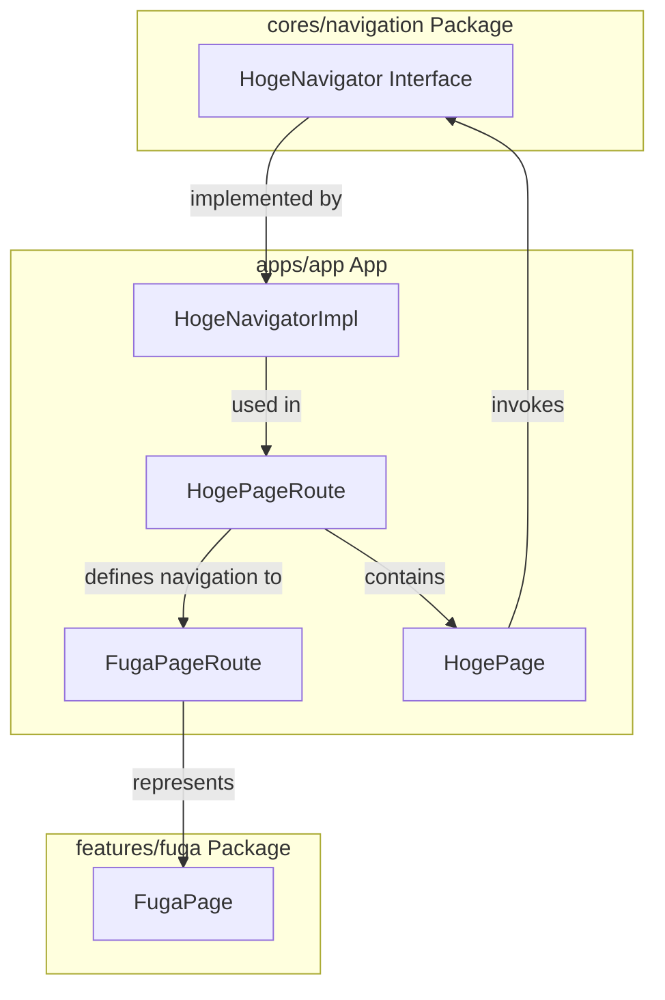

# Implementation Policy

The primary objective of our implementation policy is to ensure a seamless and scalable app structure that facilitates easy navigation and feature integration. To achieve this, we adopt a modular approach, separating the core navigation logic from feature-specific implementations. This strategy not only enhances maintainability but also allows for independent development and testing of features. Additionally, we prioritize the use of interface abstraction for navigation actions to decouple the navigation logic from its concrete implementations, enabling more flexible and interchangeable navigation strategies.

## Implementation Example

### packages/features/fuga

```text
└── src
    └── fuga
        └── fuga_page.dart
```

```dart:fuga_page.dart
import 'package:flutter/material.dart';

class FugaPage extends StatelessWidget {
  const FugaPage({
    super.key,
  });

  @override
  Widget build(BuildContext context) {
    return Scaffold(
      body: Center(
        child: const Text('FUGA PAGE'),
      );
    );
  }
}
```

### packages/cores/navigation

```text
└── src
    └── hoge
        ├── navigator.dart
        ├── provider.dart
        └── provider.g.dart
```

```dart:navigator.dart
import 'package:flutter/material.dart';

abstract interface class HogeNavigator {
  void goFugaPage(BuildContext context);
}
```

```dart:provider.dart
import 'package:cores_navigation/src/hoge/navigator.dart';
import 'package:riverpod_annotation/riverpod_annotation.dart';

part 'provider.g.dart';

@riverpod
external HogeNavigator hogeNavigator(HogeNavigatorRef ref);
```

### apps/app

```text
└── router
    ├── navigator
    │   ├── hoge_navigator.dart
    ├── provider
    │   ├── router.dart
    │   └── router.g.dart
    └── routes
        └── hoge_page_route.dart
```

```dart:hoge_navigator.dart
import 'package:cores_navigation/navigators.dart';
import 'package:flutter/material.dart';
import 'package:flutter_app/router/provider/router.dart';

final class HogeNavigatorImpl implements HogeNavigator {
  const HogeNavigatorImpl();

  @override
  void goFugaPage(BuildContext context) {
    const FugaPageRoute().go(context);
  }
}
```

```dart:hoge_page_route.dart
part of 'package:flutter_app/router/provider/router.dart';

@TypedGoRoute<HogePageRoute>(
    path: HogePageRoute.path,
    routes: [
      TypedGoRoute<FugaPageRoute>(
        path: FugaPageRoute.path,
      )
    ]
)

class HogePageRoute extends GoRouteData {
  const HogePageRoute();

  static const path = '/hoge';

  @override
  Widget build(BuildContext context, GoRouterState state) {
    return ProviderScope(
      overrides: [
        hogeNavigatorProvider.overrideWithValue(const HogeNavigatorImpl()),
      ],
      child: const HogePage(),
    );
  }
}

class FugaPageRoute extends GoRouteData {
  const FugaPageRoute();

  static const path = 'fuga';

  @override
  Widget build(BuildContext context, GoRouterState state) {
    return FugaPage();
  }
}
```

```dart:hoge_page.dart
import 'package:cores_navigation/providers.dart';
import 'package:flutter/material.dart';
import 'package:flutter_riverpod/flutter_riverpod.dart';

class HogePage extends ConsumerWidget {
  const HogePage({
    super.key,
  });

  @override
  Widget build(BuildContext context, WidgetRef ref) {
    final hogeNavigator = ref.watch(hogeNavigatorProvider);
    return Scaffold(
      body: Center(
        child: ElevatedButton(
          onPressed: () {
            hogeNavigator.goFugaPage(context);
          },
          child: const Text('GO FUGA PAGE'),
        ),
      );
    );
  }
}
```

## Explanation

To visualize the dependency graph and understand the relationship between the different parts of your application's navigation and dependency injection setup, let's start by outlining the components and their connections based on your implementation example:

1. **Core Navigation Package (`cores/navigation`):**

   - Contains the abstract interface `HogeNavigator` which declares the method `goFugaPage`, used to navigate to the `FugaPage`.

2. **App (`apps/app`):**

   - Implements `HogeNavigatorImpl` which fulfills the contract defined by `HogeNavigator`.
   - Utilizes `HogePageRoute` to inject `HogeNavigatorImpl` and defines navigation flow.
   - `HogePage` consumes `HogeNavigator` to trigger navigation.

3. **Features Package (`features/fuga`):**

   - Houses `FugaPage`, which is the target page for navigation initiated from `HogePage`.

From this overview, the Mermaid syntax to represent these dependencies would look something like this:



In this diagram:

- `HogeNavigator Interface` in the `cores/navigation` package defines the navigation contract.
- `HogeNavigatorImpl` within the `apps/app` module implements this navigation contract.
- `HogePageRoute` setups the navigation and provides `HogeNavigatorImpl` to `HogePage`.
- `FugaPageRoute` leads to `FugaPage`, which is now explicitly noted to reside in the `features/fuga` package.
- `HogePage` uses `HogeNavigator` to navigate to `FugaPage`, crossing package boundaries to access functionality defined in a separate feature module.

This structure supports modular development by separating the navigation logic and the feature-specific pages into different packages, thus enhancing maintainability and scalability of the app. It also clarifies the dependency direction, with the `apps/app` module depending on the abstract interfaces defined in `cores/navigation` and the specific feature modules like `features/fuga`, ensuring a clean separation and integration of features.
