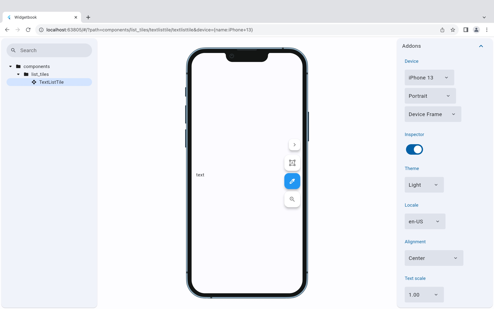
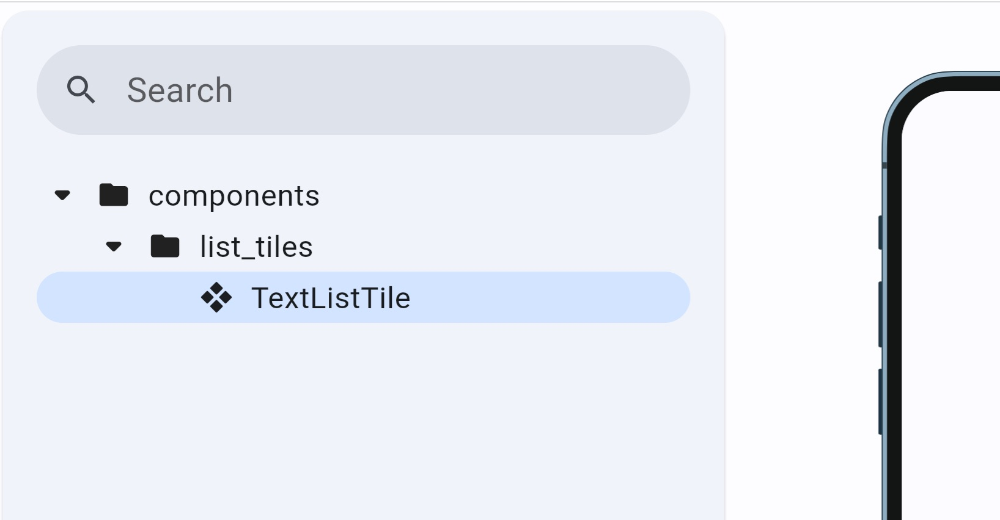

# UI catalog

This is a UI catalog application.
You can preview UI by importing and deploying UI from the cores and features packages.

Support for preview in browser and macOS



## UI preview UseCase placement

It is best to place them under the use_case directory to mimic the directory structure of each package.

```text
lib
└── use_case
    ├── cores
    │   └── designsystem
    │       └── components
    │           └── list_tiles.dart
    └── features
        ├── feature1
        └── feature2
```

> Note: The directory structure of preview reflects only the directory structure of the Package from which it is defined.
>
> (There is no influence from the structure of the use_case directory.)


