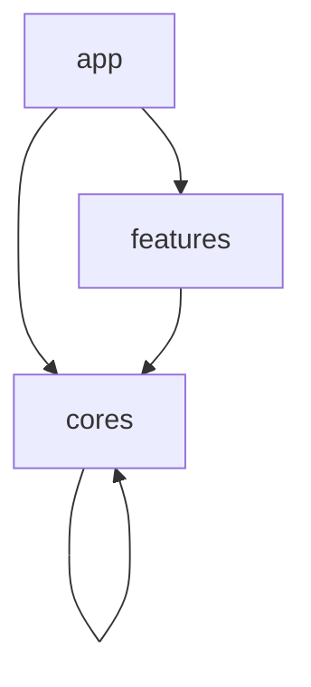

# Architecture

> [!TIP]
> Responsibilities should be discussed at the startup of the project, as how to separate them depends on the project.

## Directory Structure

The directory structure is shown below.

```text
.
├── apps
│   ├── app
│   └── catalog
│
└── packages
    ├── cores
    │   ├── ...
    │   └── ...
    │
    └── features
        ├── ...
        └── ...
```

## Packages

> [!IMPORTANT]
> - Packages in `cores` are called by app packages in `apps`, by packages in `features`, and by packages in `cores`.
> - Packages in `features` are only called from app packages in `apps`.


