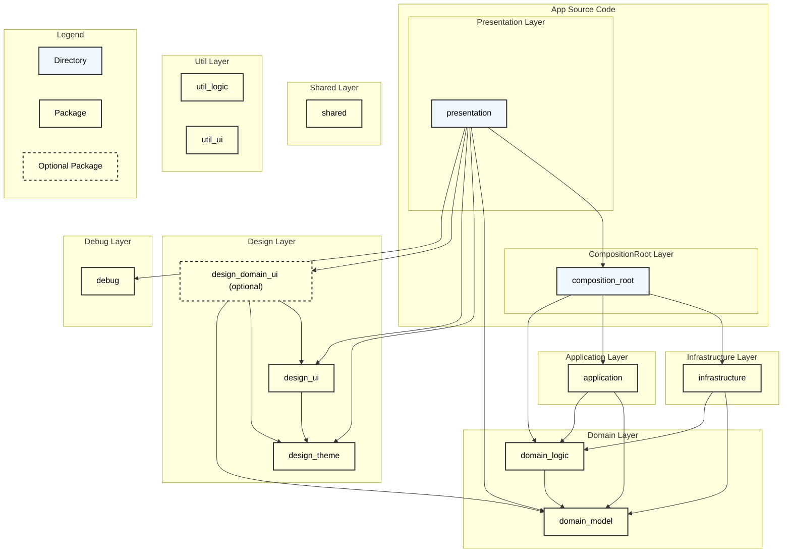
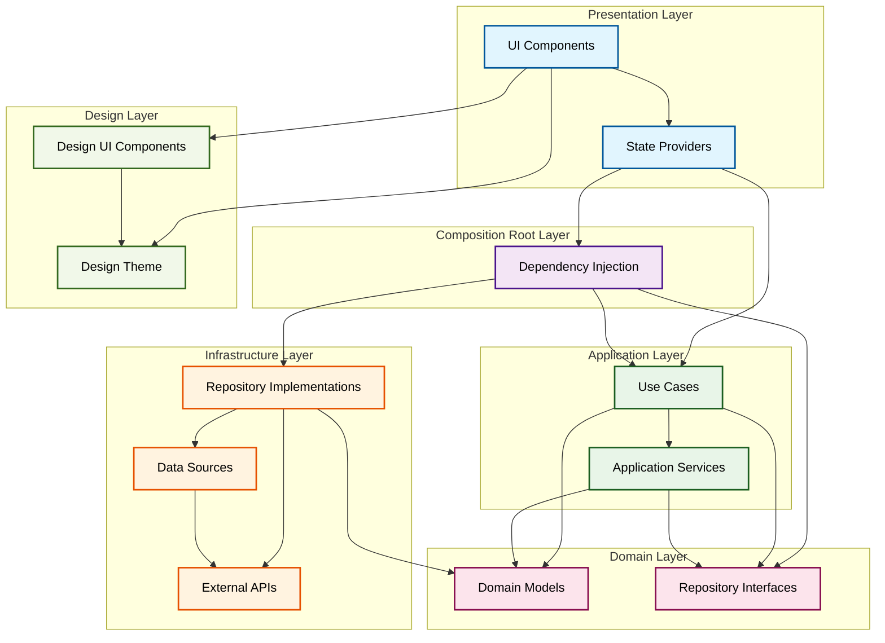

# アーキテクチャ

> [!TIP]
> 責務範囲はプロジェクトの開始時に議論するべきです。どのように分離するかはプロジェクトによって異なるためです。

## ディレクトリ構造

以下にディレクトリ構造を示します。

```bash
.
├── apps
│   ├── app
│   │   ├── presentation
│   │   └── composition_root
│   └── catalog
│
└── packages
    ├── design_domain_ui # (optional)
    ├── design_ui
    ├── debug
    ├── design_theme
    ├── application
    ├── infrastructure
    ├── domain_model
    ├── domain_logic
    ├── shared
    ├── util_logic
    └── util_ui
```

## レイヤー・パッケージ構造

> [!NOTE]
> Shared, Util, Debug レイヤーは依存の向きを記載しようとすると複雑になってしまうため、記載していません。
>
> - Shared, Util レイヤーはどのレイヤーにも依存しておらず、Shared, Util 以外の全てのレイヤーから参照可能
> - Debug レイヤーは全てのレイヤーに依存可能で、Presentation レイヤーからのみ参照される



## アーキテクチャの詳細

### 設計思想

本プロジェクトでは、**Clean Architecture** と **Composition Root パターン** を組み合わせたアーキテクチャを採用しています。

#### Clean Architecture の原則

このアーキテクチャは以下の原則に基づいて設計されています：

1. **依存関係の逆転**: 上位レイヤーは下位レイヤーに依存し、下位レイヤーは上位レイヤーに依存しない
2. **関心の分離**: 各レイヤーは明確な責務を持ち、他のレイヤーの実装詳細を知らない
3. **テスタビリティ**: 各レイヤーは独立してテスト可能
4. **保守性**: 変更の影響範囲を局所化し、拡張性を確保

#### Composition Root パターン

**Composition Root** は、アプリケーションの依存関係を構成する場所です。このパターンにより、依存関係の注入を一箇所で管理し、アプリケーションの構造を明確にします。

##### 実装場所

```shell
apps/app/lib/composition_root/
├── data_sources/              # データソースの依存関係を定義
├── repositories/              # リポジトリの依存関係を定義
└── use_cases/                 # ユースケースの依存関係を定義
```

##### 実装例

```dart
// composition_root/repositories/theme_setting_repository.dart
@riverpod
ThemeSettingRepository themeSettingRepository(Ref ref) {
  final dataSource = ref.watch(sharedPreferenceDataSourceProvider);
  return ThemeSettingRepositoryImpl(dataSource);
}
```

### 実装コンポーネント図

アーキテクチャの各レイヤーで実装される具体的なコンポーネントとその依存関係を以下の図で示します：



### レイヤー間の責務と実装パターン

#### Presentation Layer

**責務**: ユーザーインターフェースの表示とユーザー操作の処理

**実装パターン**:
- `ConsumerWidget` を使用して `Provider` の状態を監視
- ビジネスロジックは直接実装せず `Provider` を通じてユースケースを呼び出し
- UI 状態の管理は `Provider` や `Notifier`, `AsyncNotifier` を使用

**実装時の注意点**:
- すべての操作に UseCase を用意するのは過剰な場合がある
- 単純な CRUD 操作などは Presentation Layer から直接 Repository を呼び出しても良い
- 複雑なビジネスロジックや複数の Repository を組み合わせる場合は UseCase を活用
- 実際のプロジェクトでは、アーキテクチャの純粋性と実装コストのバランスを考慮して判断する

```dart
// presentation/providers/theme_setting_provider.dart
@riverpod
class ThemeSettingNotifier extends _$ThemeSettingNotifier {
  @override
  ThemeSetting build() {
    final repository = ref.watch(themeSettingRepositoryProvider);
    return repository.getThemeSetting();
  }

  Future<void> changeThemeSetting(ThemeSetting theme) async {
    final useCase = ref.read(changeThemeSettingUseCaseProvider);
    await useCase.call(theme);
    state = theme;
  }
}

// presentation/ui/setting/setting_page.dart
class SettingPage extends ConsumerWidget {
  @override
  Widget build(BuildContext context, WidgetRef ref) {
    final themeSetting = ref.watch(themeSettingNotifierProvider);

    return ElevatedButton(
      onPressed: () {
        ref.read(themeSettingNotifierProvider.notifier)
            .changeThemeSetting(ThemeSetting.light);
      },
      child: Text('テーマ変更: ${themeSetting.name}'),
    );
  }
}
```

#### Application Layer

**責務**: ユースケースの実装とアプリケーション固有のビジネスロジック

**実装パターン**:
- 各ユースケースは単一の責務を持つ
- ドメインロジックを呼び出してアプリケーション固有の処理を実装
- リポジトリインターフェースに依存し、実装詳細は知らない

```dart
// application/theme_setting/change_theme_setting_use_case.dart
class ChangeThemeSettingUseCase {
  const ChangeThemeSettingUseCase({
    required this.themeSettingRepository,
  });

  final ThemeSettingRepository themeSettingRepository;

  Future<void> call(ThemeSetting themeSetting) async {
    await themeSettingRepository.save(themeSetting);
  }
}
```

#### Infrastructure Layer

**責務**: 外部システムとの連携とデータの永続化

**実装パターン**:
- リポジトリインターフェースの実装を提供
- 外部 API、データベース、ファイルシステムとの連携
- ドメインモデルと外部データ形式の変換

```dart
// infrastructure/theme_setting/theme_setting_repository_impl.dart
class ThemeSettingRepositoryImpl implements ThemeSettingRepository {
  const ThemeSettingRepositoryImpl(this._sharedPreference);

  final SharedPreferenceDataSource _sharedPreference;

  @override
  ThemeSetting getThemeSetting() {
    return _sharedPreference.getThemeSetting();
  }

  @override
  Future<void> saveThemeSetting(ThemeSetting themeSetting) async {
    await _sharedPreference.saveThemeSetting(themeSetting.index);
  }
}
```

#### Domain Layer

**責務**: ビジネスルールとドメインロジックの実装

**実装パターン**:
- `domain_model`: エンティティ、値オブジェクト、集約の定義
- `domain_logic`: ドメインサービス、リポジトリインターフェースの定義
- 他のレイヤーに依存しない純粋なビジネスロジック

```dart
// domain_model/theme_setting/theme_setting.dart
enum ThemeSetting {
  system,
  light,
  dark,
}

// domain_logic/theme_setting/theme_setting_repository.dart
abstract class ThemeSettingRepository {
  ThemeSetting getThemeSetting();
  Future<void> saveThemeSetting(ThemeSetting themeSetting);
}
```
