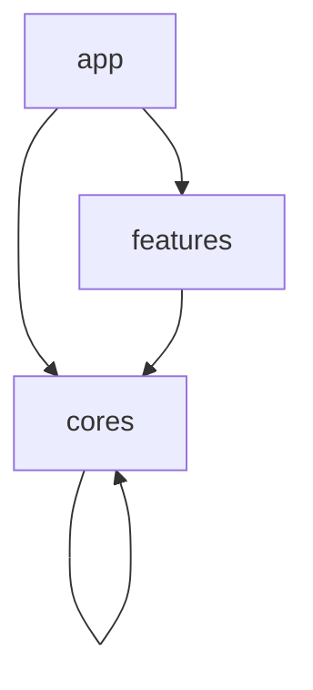

## Directory Structure

```text
.
├── apps
│   ├── app
│   └── catalog
│
└── packages
    ├── cores
    │   ├── core
    │   ├── data
    │   ├── designsystem
    │   └── init
    │
    └── features
        ├── debug_mode
        └── github_repository
```

## Architecture


