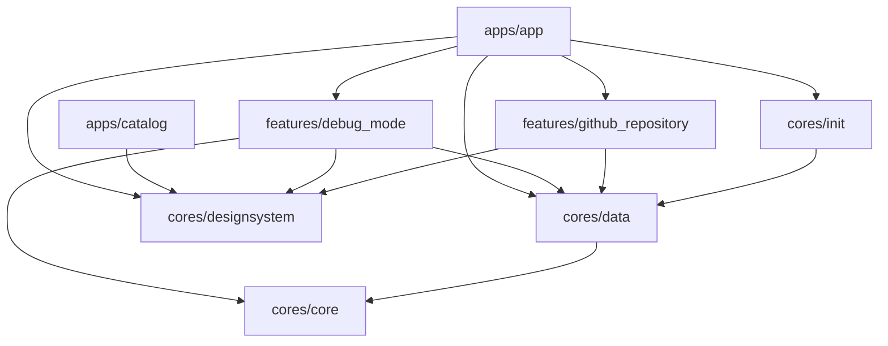

## Directory Structure

```text
.
├── apps
│   ├── app
│   └── catalog
│
└── packages
    ├── cores
    │   ├── core
    │   ├── data
    │   ├── designsystem
    │   └── init
    │
    └── features
        ├── debug_mode
        └── github_repository
```

## Architecture



## Packages

A multi-package strategy is used, and this template includes the following packages:

| Name                                   | Responsibilities                                                                                                                                      | Key files and good examples                                  |
|:---------------------------------------|:------------------------------------------------------------------------------------------------------------------------------------------------------|:-------------------------------------------------------------|
| `apps/app`                             | Brings everything together required for the app to function correctly. This includes UI scaffolding and navigation.                                   | `lib/main.dart`                                              |
| `apps/catalog`                         | Summarize the functionality for viewing the UI defined in the design system package and the features package.                                         | `lib/use_case/cores/designsystem/components/list_tiles.dart` |
| `features/1`,<br/>`features/2`<br/>... | Functionality associated with a specific feature or user journey. Typically contains UI components and Providers which read data from other packages. | `lib/src/ui/github_repository_list.dart`                     |
| `cores/core`                           | Common classes shared between packages.                                                                                                               | `lib/src/exception/app_exception.dart`                       |
| `cores/data`                           | Fetching app data from multiple sources, shared by different features.                                                                                | `lib/src/network/provider/dio.dart`                          |
| `cores/designsystem`                   | Design system which includes Core UI components (many of which are customized Material 3 components), app theme and icons.                            | `lib/src/themes/theme.dart`                                  |
| `cores/init`                           | Summarize the application initialization process.                                                                                                     | `lib/src/provider/initialize_providers.dart`                 |
