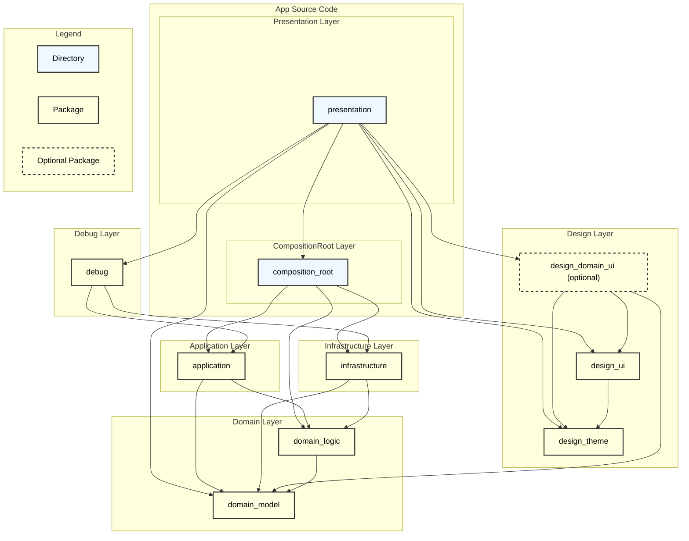

# アーキテクチャ

> [!TIP]
> 責務範囲はプロジェクトの開始時に議論するべきです。どのように分離するかはプロジェクトによって異なるためです。

## ディレクトリ構造

以下にディレクトリ構造を示します。

```bash
.
├── apps
│   ├── app
│   │   ├── presentation
│   │   └── composition_root
│   └── catalog
│
└── packages
    ├── cores
    │   ├── core
    │   └── data
    ├── features
    │   └── debug
    ├── design_domain_ui # (optional)
    ├── design_ui
    ├── design_theme
    ├── application
    ├── infrastructure
    ├── domain_model
    └── domain_logic
```

## レイヤー・パッケージ構造


