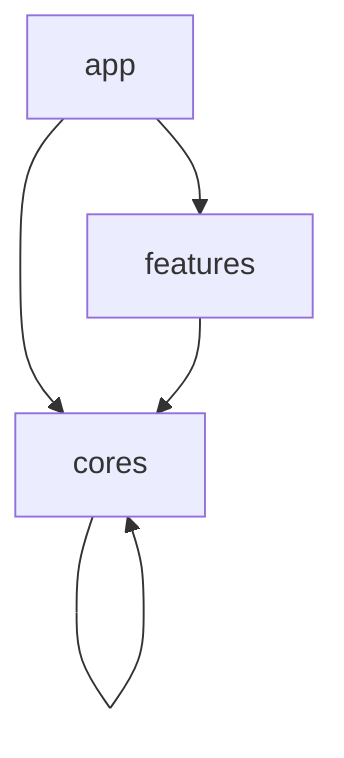

# アーキテクチャ

> [!TIP]
> 責務範囲はプロジェクトの開始時に議論するべきです。どのように分離するかはプロジェクトによって異なるためです。

## ディレクトリ構造

以下にディレクトリ構造を示します。

```text
.
├── apps
│   ├── app
│   └── catalog
│
└── packages
    ├── cores
    │   ├── ...
    │   └── ...
    │
    └── features
        ├── ...
        └── ...
```

## パッケージ

> [!IMPORTANT]
>
> - `cores` のパッケージは `apps` のアプリパッケージ、`features` のパッケージ、および `cores` のパッケージから呼び出されます。
> - `features` のパッケージは `apps` のアプリパッケージからのみ呼び出されます。


