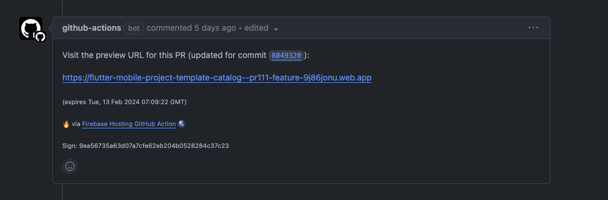
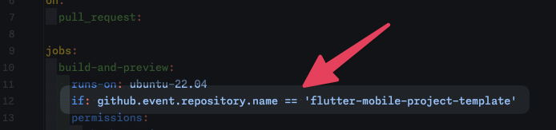
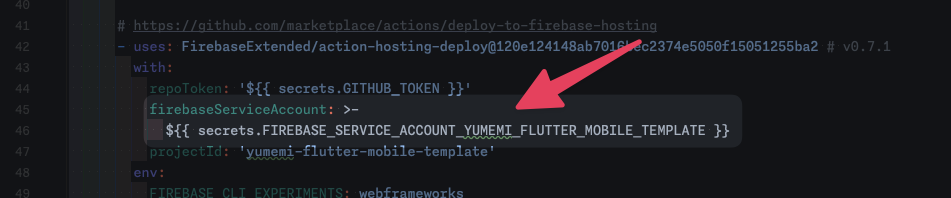
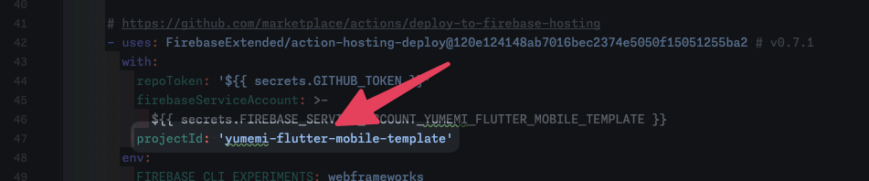

# Firebase Hosting Preview

In this project, the Widgetbook of `apps/catalog` is made available for review at PullRequest time.
When you create a new project using this template project, please follow the instructions below to set it up.



## 1. Create Firebase project

Create a Firebase project according to the [documentation][1].

## 2. Initialize Firebase Hosting

Initialize Firebase Hosting according to the [documentation][2].

## 3. Update the project's Firebase Hosting settings

Execute the following command

```shell
$ firebase init hosting:github
```

Complete the setup using the following output as a reference

```shell
$ firebase init hosting:github

     ######## #### ########  ######## ########     ###     ######  ########
     ##        ##  ##     ## ##       ##     ##  ##   ##  ##       ##
     ######    ##  ########  ######   ########  #########  ######  ######
     ##        ##  ##    ##  ##       ##     ## ##     ##       ## ##
     ##       #### ##     ## ######## ########  ##     ##  ######  ########

You're about to initialize a Firebase project in this directory:

Before we get started, keep in mind:

  * You are initializing within an existing Firebase project directory


=== Project Setup

First, let's associate this project directory with a Firebase project.
You can create multiple project aliases by running firebase use --add, 
but for now we'll just set up a default project.

i  Using project flutter-project

=== Hosting:github Setup

i  Detected a .git folder at /path
i  Authorizing with GitHub to upload your service account to a GitHub repository's secrets store.

Visit this URL on this device to log in:
https://github.com/login/oauth/authorize?client_id=

Waiting for authentication...

✔  Success! Logged into GitHub as username

? For which GitHub repository would you like to set up a GitHub workflow? (format: user/repository) username/repository

✔  Created service account github-action-XXXXXXXXX with Firebase Hosting admin permissions.
✔  Uploaded service account JSON to GitHub as secret FIREBASE_SERVICE_ACCOUNT_XXXX.
i  You can manage your secrets at https://github.com/username/repository/settings/secrets.

? Set up the workflow to run a build script before every deploy? No
? GitHub workflow file for PR previews exists. Overwrite? firebase-hosting-pull-request.yml No
? Set up automatic deployment to your site's live channel when a PR is merged? No

i  Action required: Visit this URL to revoke authorization for the Firebase CLI GitHub OAuth App:
https://github.com/settings/connections/applications/89cf50f02ac6aaed3484
i  Action required: Push any new workflow file(s) to your repo

i  Writing configuration info to firebase.json...
i  Writing project information to .firebaserc...

✔  Firebase initialization complete!
```

## 4. Change workflow content

Modify `.github/workflows/firebase-hosting-pull-request.yaml`.

### 4-1. Remove repository name condition

To avoid inadvertent execution of the workflow when a new project is created based on this template project, we have
included an activation condition by repository name.
This description is no longer needed during setup, so please delete it.



### 4-2. Change Firebase Service Account name

Replace with the name of the Firebase Service Account created by the `firebase init hosting:github` command.



### 4-3. Change projectId to the ID of the relevant project

Replace the Firebase project.



<!-- Links -->

[1]: https://firebase.google.com/docs/web/setup

[2]: https://firebase.google.com/docs/hosting/quickstart
