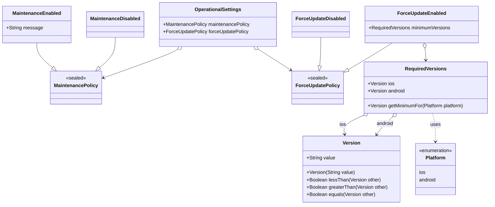

# モデリング

## ドメインモデル設計方針

### レイヤードアーキテクチャの遵守

ドメインモデル（エンティティ・値オブジェクト）は全て `packages/domain_model` 配下に集約して管理します。
ドメインロジックやサービス的な処理は必要に応じて `packages/domain_logic` に分離しますが、純粋なデータ構造や値オブジェクトは必ず `domain_model` に配置します。

### イミュータブル設計

ドメインモデルは原則としてイミュータブル（不変）で設計します。
Dartの [`freezed` パッケージ](https://pub.dev/packages/freezed) や [Extension types](https://dart.dev/language/extension-types) を活用し、状態の変更は新しいインスタンスの生成で表現します。

### 値オブジェクトとエンティティの区別

- 値オブジェクト：同じ値であれば同一とみなす（例：`VersionString` など）
- エンティティ：一意な識別子や状態を持つ（例：`MaintenanceModeSettingsState` など）

### ドメインロジックの内包

値オブジェクトやエンティティは、単なるデータの入れ物ではなく、関連するドメインロジック（例：バージョン比較）も内包します。
複雑なドメインロジックやサービス的な処理は `domain_logic` に分離し、モデル自体には最小限のロジックのみを持たせます。

## 各領域（集約）ごとのクラス設計

> [!NOTE]
> 各領域（集約）のクラス設計が大規模・複雑になる場合は、ドキュメントを別ファイルに切り出して管理することを推奨します。

### 運用設定 (OperationalSettings)

アプリケーション全体の運用に関わる設定（メンテナンスモード、強制アップデート）を管理する集約です。
通常、Firebase Remote Config や設定 API などから一括で取得され、アプリケーションの動作を制御するために利用されます。

**集約ルート**: `OperationalSettings`

**構成要素**:

- `OperationalSettings`: 集約ルート。`MaintenancePolicy` と `ForceUpdatePolicy` を保持する。
- `MaintenancePolicy` (`sealed`): メンテナンスの状態 (`Enabled` / `Disabled`) を表現する。
- `ForceUpdatePolicy` (`sealed`): 強制アップデートのポリシー (`Enabled` / `Disabled`) を表現する。
- `RequiredVersions`: `ForceUpdateEnabled` が保持する、プラットフォームごとの最低要求バージョン。
- `Version`: バージョンを表す値オブジェクト。
- `Platform`: プラットフォーム (`ios` / `android`) を表す値オブジェクト (Enum)。

**クラス図**:

