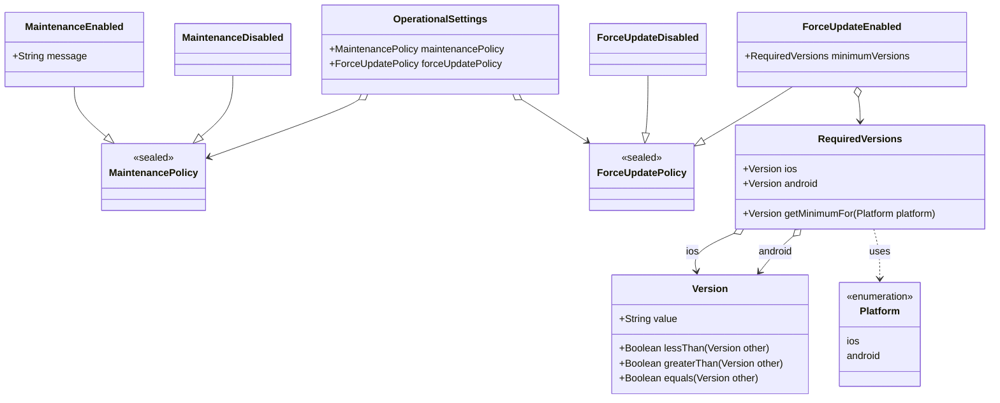
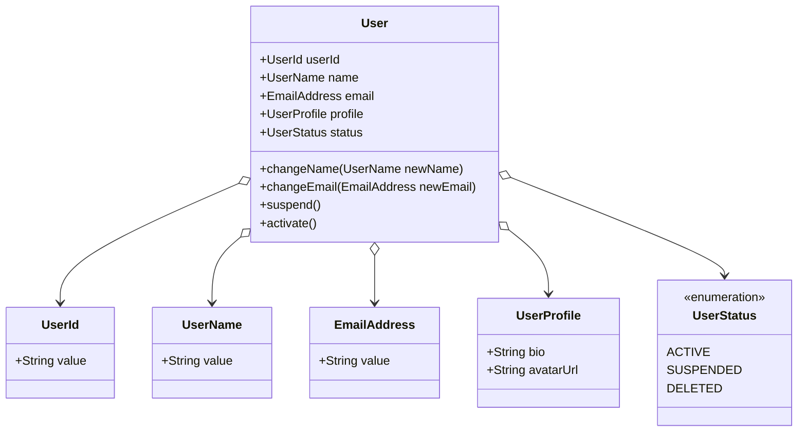

# モデリング

## ドメインモデル設計方針

本プロジェクトにおけるドメインモデルの設計方針を以下に示します。

### レイヤードアーキテクチャの遵守

ドメイン層は、アプリケーションの関心事の中核をなす部分です。技術的な詳細やインフラストラクチャからは独立させます。

- **`packages/domain_model`**:
  - **役割**: 集約 (Aggregate)、エンティティ (Entity)、値オブジェクト (Value Object) を配置します。これらは、ドメインの概念、ルール、およびそれらに関連する**固有のロジック**をカプセル化します。
  - **原則**: 他のレイヤー（特にインフラストラクチャ層や UI 層）への依存を持ちません。
- **`packages/domain_logic`**:
  - **役割**: ドメインサービスや、複数の集約にまたがるドメインロジック、アプリケーション固有のユースケースを配置します。
  - **原則**: `domain_model` に依存しますが、その逆はありません。ドメインモデルのオブジェクトを利用して、具体的なビジネスプロセスを実現します。

### イミュータブル（不変）設計

ドメインモデルは原則として **イミュータブル(不変)** で設計します。
状態の変更は、既存のインスタンスを変更するのではなく、**新しいインスタンスを生成する**ことで表現します。

これにより、予期せぬ副作用を防ぎ、状態管理を単純化し、コードの予測可能性を高めます。
Dart の [`freezed` パッケージ](https://pub.dev/packages/freezed) や [Extension types](https://dart.dev/language/extension-types) などの言語機能やライブラリを積極的に活用します。

### 値オブジェクトと集約ルート/エンティティの区別

- **値オブジェクト (Value Object)**:
  - **特徴**: 属性によって定義され、識別子を持ちません。同じ属性値を持つオブジェクトは同一とみなされます。イミュータブルであることが強く推奨されます。
  - **例**: `Version`, `Platform`, `RequiredVersions`
- **集約ルート (Aggregate Root) / エンティティ (Entity)**:
  - **特徴**: ライフサイクルを通じて一意な識別子を持ちます。状態が変化しても、その同一性は保持されます。集約ルートは、関連するオブジェクト群（集約）の一貫性を保つ責任を持ちます。
  - **例**: `OperationalSettings`

### ドメインロジックの内包（リッチドメインモデル）

値オブジェクトやエンティティは、単なるデータの入れ物（アネミックドメインモデル）ではなく、**関連するドメインロジック**（例：バージョン比較、ポリシー判定の基本ロジック）も**内包**します。

ただし、複数の集約にまたがるロジックや、永続化などのインフラ層に関わる処理は、ドメインサービスやアプリケーションサービスに配置します。

## 各領域（集約）ごとのクラス設計

> [!NOTE]
> 各領域（集約）のクラス設計が大規模・複雑になる場合は、このドキュメントから別ファイルに切り出して管理することを推奨します。

### 運用設定 (OperationalSettings)

アプリケーション全体の運用に関わる設定（メンテナンスモード、強制アップデート）を管理する集約です。
通常、Firebase Remote Config や設定 API などから一括で取得され、アプリケーションの動作を制御するために利用されます。

**集約ルート**: `OperationalSettings`

**構成要素**:

- `OperationalSettings`: 集約ルート。`MaintenancePolicy` と `ForceUpdatePolicy` を保持する。
- `MaintenancePolicy` (`sealed`): メンテナンスの状態 (`Enabled` / `Disabled`) を表現する。
- `ForceUpdatePolicy` (`sealed`): 強制アップデートのポリシー (`Enabled` / `Disabled`) を表現する。
- `RequiredVersions`: `ForceUpdateEnabled` が保持する、プラットフォームごとの最低要求バージョン。
- `Version`: バージョンを表す値オブジェクト。
- `Platform`: プラットフォーム (`ios` / `android`) を表す値オブジェクト (Enum)。

**クラス図**:

**設計ポイント**:

- `MaintenancePolicy` と `ForceUpdatePolicy` は `sealed class` (または Dart の `freezed` を使った Union Type) で実装することで、状態を型レベルで安全に表現し、`when` などで網羅的なチェックを可能にします。
- `Version` は比較ロジックを持つ値オブジェクトとして設計します。
- この集約は、主に設定の読み取りと解釈に焦点を当てています。設定の変更ロジックが必要な場合は、`OperationalSettings` に適切なメソッドを追加します。

### 参考例：ユーザー (User)

アプリケーションを利用するユーザーを表す、多くのシステムにおける中核的な集約です。
ユーザー登録、ログイン、プロフィール変更、退会といったライフサイクルを持ちます。

**集約ルート**: `User`

**構成要素**:

- `User`: 集約ルート (エンティティ)。ユーザーの核となる情報と振る舞いを管理する。
- `UserId`: ユーザーの一意な識別子を表す値オブジェクト。
- `UserName`: ユーザー名を表す値オブジェクト (文字数制限などのルールを含む)。
- `EmailAddress`: メールアドレスを表す値オブジェクト (フォーマット検証などを含む)。
- `UserProfile`: プロフィール情報 (自己紹介、アバターURLなど) を保持する値オブジェクト。
- `UserStatus`: ユーザーの状態 (アクティブ、一時停止中、退会済みなど) を表す値オブジェクト (Enum)。

**クラス図**:

